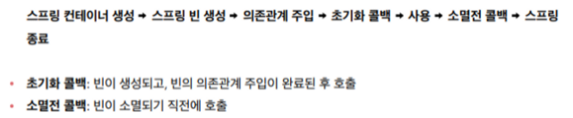
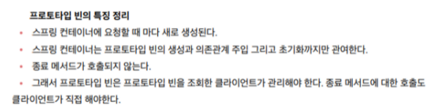
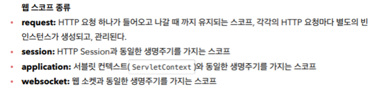

# 빈 CallBack & 빈 스코프

## 빈 생명주기 CallBack
- ### 빈 생명주기 콜백
    - 데이터베이스 커넥션 풀이나 네트워크 소켓처럼 미리 연결하고 종료시점에 연결을 모두 종료하는 작업을 진행하려면 객체의 초기화와 종료 작업이 필요하다
    - 스프링 빈은  (객체 생성 → 의존관계 주입) 과 같은 라이프 사이클을 갖는다.
    - 스프링은 의존관계 주입이 완료되면 스프링 빈에게 콜백 메서드를 통해서 초기화 시점을 알려주는 다양한 기능을 제공한다. 또한 스프링은 스프링 컨테이너가 종료되기 직전에 소멸 콜백을 준다. 따라서 안전하게 종료 작업을 진행할 수 있다.
    - 스프링 빈의 이벤트 이벤트 라이프사이클

      

    - **참고 : 객체의 생성 ( 인스턴스 생성 )  과 초기화 ( 커넥션 연결 , 기타 로직 ) 은 분리하자!**
        - 생성자에서는 객체 인스턴스를 생성하는 것에만 집중하고 다른 연결과 같은 것들은 분리하는 것이 유지보수 관점에서 좋다.
- ### 3가지 빈 생명주기 콜백 By 스프링
    - #### 인터페이스
        - `implements InitializingBean` 을 하면 `afterPropertiesSet()` 을 오버라이딩 한다. 의존관계 주입이 끝나면 세팅을 한다. → 초기화 콜백
        - `implements  DisposableBean` 을 하면 `destroy()` 을 오버라이딩 한다. 사용이 완료되면 호출을 한다. → 소멸전 콜백
        - 이 인터페이스는 스프링 전용 인터페이스이다. → 외부 라이브러리에 적용할 수 없고, 초기화 , 소멸 메소드 이름을 변경 불가능하다.
        - 인터페이스 사용하는 방법은 **스프링 초창기의 버전**이고 **요즘에는 거의 사용하지 않는다.**
    - #### 메서드
        - `@Bean(initMethod = "init", destroyMethod = "close")` 초기화 , 소멸 메서드를 지정할 수 있다. 메서드 이름을 자유롭게 줄 수 있다는 것이 장점이다.
        - 스프링 빈이 스프링 코드에 의존하지 않는다
        - 코드가 아니라 설정 정보를 이용하기 때문에 코드를 고칠 수 없는 외부 라이브러리에서도 메서드를 적용가능하다. → 제일 큰 장점이다.
        - 종료 메서드는 메서드를 추론해서 호출하는 기능이 있어서 따로 적어주지 않아도 대부분 잘 작동한다. 추론 기능을 사용하지 않으려면 빈 공백을 지정하면 된다. ( close or shutdown 추론 )
    - #### 애노테이션
        - `@PostConstruct` 초기화 콜백
        - `@PreDestroy` 소멸 콜백
        - 자바 표준 기술이기 때문에 스프링이 아닌 다른 컨테이너에서도 동작한다. → 컴포넌트 스캔과 잘 작동한다.
        - 유일한 단점 → 외부 라이브러리에 적용하지 못한다. 외부 라이브러리를 초기화 , 종료 해야 한다면 메서드 방식을 이용하자!

## 빈 스코프
- 빈 스코프란?
    - 빈 스코프란 빈이 존재할 수 있는 범위를 의미한다.
    - 싱글톤 스코프 : 기본 스코프이다. 스프링 컨테이너의 시작과 종료까지 유지되는 가장 넓은 범위의 스코프이다.
    - 프로토타입 : 스프링 컨테이너는 프로토타입 빈의 생성과 의존관계 주입까지만 관여하고 더는 관여하지 않는 매우 짧은 범위의 스코프이다.
    - 웹 관련 스코프
        - request
        - session
        - application
- 프로토타입 스코프
    - 스프링 컨테이너에 프로타입 빈에 대한 새로운 요청이 올 때마다 프로토타입 빈을 생성하고 필요한 의존관계를 주입한다. 이 프로토타입 빈을 클라이언트에 반환하고 더이상 반환받거나 관리하지 않는다. → 스프링 컨테이너는 스프링 프로토타입 빈을 생성하고 의존관계 주입 , 초기화 까지만 처리한다. → 프로토타입 빈을 관리하는 책임은 클라이언트에게 있다. 종료메서드가 호출되지 않는다.

      

- 프로토타입 스코프 - 싱글톤 빈과 함께  사용 시 문제점
    - 싱글톤 빈과 함께 사용하면 의도한 대로 잘 동작하지 않는다.
    - 싱글톤 빈에 프로토타입 빈을 의존관계 주입하여 사용하면 각 클라이언트의 결과값이 각각 나타나는 것이 아니라 싱글톤 빈을 가장 바깥에서 사용했기 때문에 공유되는 결과가 나온다.
    - 각각 필드 주입받을 수 있으나 스프링에 의존적인 코드가 생기기 때문에 좋은 해결방법이 아니다.
- 프로토타입 스코프 - 싱글톤 빈과 함께 사용시 Provider로 문제 해결
    - 의존관계를 외부에서 주입받는 것이 아니라 직접 필요한 의존관계를 찾는 것을 Dependency Lookup(DL) 의존관계 조회(탐색)이라고 한다.
    - `ObjectFactory` (상위), `ObjectProvider` (하위 , 최신) - 둘 다 스프링에 의존적이다.
        - 내부에서 스프링 컨테이너를 통해 해당 빈을 찾아서 반환한다.
    - `JSR-330 Provider` - 스프링에 의존적이지 않는 최신 기술 ( JSR-330 자바 표준 )
        - gradle에 라이브러리에 추가해야 한다..
        - `private Provider<PrototypeBean> prototypeBeanProvider;`
        - `PrototypeBean prototypeBean = prototypeBeanProvider.get();`
        - 내부에서 스프링 컨테이너를 통해 해당 빈을 찾아서 반환한다. (DL)
        - 자바 표준이고 , mock 코드 , 단위테스트 생성에 용이하다.
        - 자바 표준이므로 스프링이 아닌 다른 컨테이너에서도 사용가능하다.
    - 정리
        - 실무에서는 싱글톤 빈으로 대부분의 문제가 해결 가능하기 때문에 프로토타입 빈을 사용하는 일은 매우 드물다.
        - `ObjectProvider` ,`JSR-330 Provider`
        - 참고 - 대부분 자바 표준과 스프링이 제공하는 기능이 겹칠때가 많이 있다. 스프링에서 다양하고 편리한 기능을 제공하기 때문에 특별히 다른 컨테이너를 사용할 일이 없다면 스프링이 제공하는 기능을 사용하면 된다.
- 웹 스코프

  

    - 웹 환경에서 동작한다.
    - 프로토 타입과 다르게 스프링이 종료시점까지 관리한다. 종료 메서드가 호출된다.
- requset 스코프 예제 만들기
    - `implementation 'org.springframework.boot:spring-boot-starter-web’`  웹 어플리케이션을 실행하는 의존성 추가 → 이 라이브러리에서 내장 톰켓 서버를 활용해서 웹 서버와 스프링을 함께 실행한다.
    - 빈이 생성되는 시점에는 URL을 알 수 가 없기 때문에 setter로 입력받는다.
    - 스코프의 생명주기는 request 요청이 들어올 때 부터 나갈 때 까지이다. → request 요청이 없다면 오류가 발생하게 된다.
    - 스프링 웹에 익숙해지면 인터셉터를 사용해서 공통 로직을 구현 가능하다.
    - 서비스 계층은 웹 기술에 종속되지 않고 , 가급적 순수하게 유지하는 것이 유지보수 관점에서 좋다.
- 스코프와 Provider
    - `private final ObjectProvider<MyLogger> myLoggerProvider;`
    - `private final ObjectProvider<MyLogger> myLoggerProvider;`
    - 요청이 왔을 때 Dependency LookUp 하도록 코드를 변경한다.
    - 기존에는 빈이 있는 데? 요청을 받지 않아서 생기는 오류 → 이것을 요청이 왔을 때 빈을 생성하도록 변경 → 빈의 생성을 지연
    - 컨트롤러와 서비스 계층에서 각각 `ObjectProvider` 를 호출해도 같은 스프링 빈이 반환된다. → 스프링이 자동으로
- 스코프와 프록시
    - `@Scope(value = "request", proxyMode = ScopedProxyMode.TARGET_CLASS)`
        - 적용 대상이 클래스면 `TAGET_CLASS` , 인터페이스라면 `INTERFACE`
        - CGLIB 라이브러리가 내 클래스를 상속 받은 가짜 프록시 객체를 만들어서 주입한다. 원본을 상속 받아서 만들어져서 클라이언트는 알 수 없게 동일하게 사용한다. ( 다형성 )
        - 프록시 객체는 요청이 실제 발생하면 스프링 내부에서 진짜 빈을 요청하는 위임 로직이 들어있다.
        - 해당 프록시 객체는 싱글톤 방식으로 동작한다.
        - 핵심 아이디어 → 진짜 객체 조회를 꼭 필요한 시점까지 지연처리(지연로딩) 한다는 점이다.
        - 주의점
            - 싱글톤처럼 작동하지만 , 실제로 싱글톤은 아니기 때문에 주의해서 사용
            - 무분별하게 사용하면 유지보수가 어려워진다.