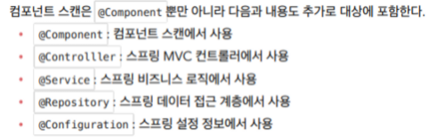
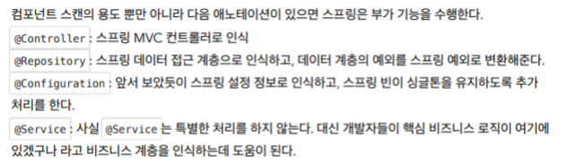
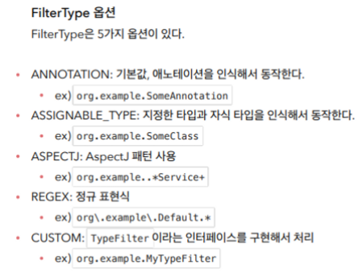

# 컴포넌트 스캔

- ## 컴포넌트 스캔과 의존관계 자동 주입 시작하기
    - 실제 서비스에서는 스프링 빈의 개수가 너무 많기 때문에 일일이 등록하기가 어려워진다. 그래서 스프링은 설정 정보가 없어도 스프링 빈을 등록하는 컴포넌트 스캔이라는 기능을 제공한다.
    - 또 의존관계를 자동하는 `@Autowired` 를 사용하기도 한다.
    - `@ComponentScan` 을  사용하면 `@Configuration` 이 붙은 설정 정보도 자동으로 등록되기 때문에 `excludeFilters = @ComponentScan.Filter(type = FilterType.*ANNOTATION*, classes = Configuration.class)`  을 사용해서 기존 설정 정보는 필터로 제외해야 한다. 보통은 제거할 일이 없으나 예제에서는 기존 코드를 남기기 위해서 사용했다. `@Configuration` 내부코드에 `@Component` 가 포함되어 있기 때문..
    - 컴포넌트 스캔은 기본적으로 클래스 명을 사용하되 맨 앞글자만 소문자로 사용한다. 빈 이름을 직접 지정도 가능하다. Autowired를 통해 의존관계는 자동주입된다. 같은 타입이 여러개라면 ?? 그건 뒤에서 설명한다.
- ## 탐색 위치와 기본 스캔 대상
    - `basePackages = "Inflearn.core.member"`  이런식으로 탐색할 패키지의 시작 위치를 지정할 수 있다. 이 패키지를 포함한 하위 패키지를 모두 탐색한다. 시작 위치를 여러 개 지정할 수 있다.
    - `basePackageClasses` 지정한 클래스의 패키지를 탐색 시작 위치로 지정한다.
    - 지정이 없으면 `@ComponentScan` 이 붙은 설정 정보 클래스의 패키지가 시작 위치가 된다.
    - 일반적으로 패키지 위치를 지정하지 않고 설정 정보 클래스의 위치를 프로젝트 최상단에 두는 것을 권장한다. 스프링 부트도 이 방법을 기본으로 제공한다.
    - `@SpringBootApplication` 안에 `@ComponentScan` 를 기본적으로 포함하고 있다. → 자동으로 스프링 빈을 관리한다. → `@ComponentScan` 를 쓸 필요가 없어진다..

      

    - 애노테이션에는 상속관계라는 것이 없다. 애노테이션이 특정 애노테이션을 가지고 있는 것을 인식할 수 있는 것은 자바 언어가 지원하는 것이 아니라 스프링이 지원하는 기능이다 !

      

- ## 필터
    - `includeFilters = @ComponentScan.Filter(type = FilterType.*ANNOTATION*, classes = MyIncludeComponent.class)` includeFilters → 컴포넌트 스캔 대상을 추가로 지정한다.
    - `excludeFilters = @ComponentScan.Filter(type = FilterType.*ANNOTATION*, classes = MyExcludeComponent.class)` excludeFilters → 컴포넌트 스캔 대상에서 제외한다.
    - 애노테이션을 추가해서 각 Bean을 등록하거나 등록하지 않을 수 있다.
    - FilterType 옵션 종류 - ComponentScan 이 있어서 거의 사용할 일이 없고 기본 설정에 최대한 맞추어서 사용하는 것이 권장되고 선호되는 편이다.

      

- ## 중복 등록과 충돌
    - 자동 빈 등록 VS 자동 빈 등록
        - 컴포넌트 스캔에 의해 스프링 빈이 등록 , 그 이름이 같은 경우 스프링은 오류 발생 → `ConflictingBeanDefinitionException` 오류 발생
    - 수동 빈 등록 VS 자동 빈 등록
        - 수동 빈 등록이 우선권을 갖는다. 수동 빈 등록 시 대체에 대한 로그가 출력된다. 이게 의도된 결과라면 괜찮지만 보통은 의도하지 않고 설정이 꼬이는 경우가 있다
        - 따라서 최근 스프링 부트에서는 이런 경우에 오류를 발생하도록 한다. 만약 오류가 발생하지 않도록 설정을 변경하고 싶으면 `spring.main.allow-bean-definition-overriding=true` 을 추가해주어야 한다.