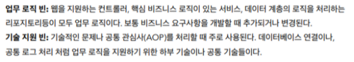

# 의존관계 주입

- ## 다양한 의존관계 주입 방법
    - ### 생성자 주입 (가장 많이 사용)
        - 생성자를 통해서 의존관계를 주입받는 방법이다.
        - 특징
            - 생성자 호출시점에 딱 1번 호출되는 것이 보장된다.
            - 불변 , 필수 의존관계에 사용한다.
            - 생성자가 1개 만 있다면 `@Autowired` 를 생략해도 자동 주입이 보장된다.
    - ### 수정자 주입 ( Setter 주입 )
        - setter를 통해서 의존관계를 주입받는 방법이다.
        - 특징
            - 선택, 변경 가능성이 있는 의존관계에 사용한다.
            - `@Autowired` 의 기본 동작은 주입할 대상이 없으면 오류가 발생한다. 주입할 대상이 없어도 동작하게 하려면 `@Autowired(required = false)` 로 지정하면 된다.
    - ### 필드 주입
        - 필드에 바로 주입하는 방법이다.
        - 특징
            - 코드가 간결하다. 그러나 외부에서 변경이 불가능해서 테스트 하기 힘들다는 단점이 있다.
            - DI 프레임워크가 없으면 아무것도 할 수 없다. ( 스프링이 없는 환경에서는 테스트가 불가능하다  )
            - 애플리케이션의 실제 코드와 관련없는 테스트 코드나 스프링 설정을 목적으로 하는 `@Configuration` 에서 특별한 용도로만 사용한다.
    - ### 일반 메서드 주입
        - 일반 메서드를 통해서 주입 받을 수 있다.
        - 특징
            - 한번에 여러 필드를 주입 받을 수 있다.
            - 일반적으로 잘 사용하지 않는다.
            - 의존관계 자동 주입은 스프링 컨테이너가 관리하는 스프링 빈이어야 작동한다. 따라서 스프링 빈이 아닌 클래스에서 `@Autowired` 코드를 적용하는 경우 아무 동작을 하지 않는다.
- ## 옵션 처리
    - `@Autowired(required = false)` 자동 주입할 대상이 없으면 수정자 메서드 자체가 호출이 되지 않는다. ( 호출자체가 안 된다. )
    - `@Nullable` 자동 주입할 대상이 없으면 null이 입력된다.
    - `Optional<Member>` 자동 주입할 대상이 없으면 `Optional.empty` 이 입력된다.
    - `@Nullable` 과 `Optional<>` 은 스프링 전반에 지원된다. 어떤게 더 좋을까나??
    - 코틀린에서는 nullable을 지원하기 때문에 자바와는 조금 다르다..
- ## 생성자 주입을 선택해라 !
    - 스프링을 포함한 DI 프레임워크 대부분이 생성자 주입을 권장한다.
    - ### 불변
        - 대부분의 의존관계 주입은 애플리케이션 종료시점까지 변경할 일이 없다. 또한 변해서는 안된다.
        - 수정자 주입을 사용한다면 변경될 가능성이 존재한다. 그러나 생성자 주입은 딱 한 번 호출되기 때문에 불변을 보장한다.
    - ### 누락
        - 프레임워크 없이 순수한 자바 코드 단위 테스트 하는 경우
            - 수정자 주입을 사용하는 경우 테스트를 실시하면 의존관계 주입이 누락되었을 때 NPE 이 발생하지만 , 생성자 주입을 사용하면 주입 데이터가 누락되었을 때 , 컴파일 오류가 발생한다.
    - ### final 키워드
        - 생성자 주입을 사용하면 필드에 final 키워드를 사용가능하다. 생성자에서 혹시라도 값이 설정되지 않는 ( NULL ) 의 경우를 컴파일 시점에서 막아준다. 컴파일 오류 → 세상에서 가장 빠르고 좋은 오류!
        - 오직 생성자 주입 방식에서만 final 키워드를 사용할 수 있다. 나머지 주입 방식은 모두 생성자 이후에 호출되기 때문이다.
- ## 롬복과 최신 트랜드
    - 실제 개발을 하면 거의 다 불변이고 , final 키워드를 사용한다 → 반복되는 코딩이 생김
    - Lombok 라이브러리를 사용하면 이를 해결할 수 있다.
    - `@RequiredArgsConstructor` 애노테이션을 추가하면 final 이 붙은 필드를 모아서 생성자를 자동으로 만들어준다. 컴파일 시점에 생성자 코드를 자동으로 생성하기 때문에 동일하다.
    - Lombok plugin 필수 , Enable annotaion processing 옵션 필수
- ## 조회 빈이 2개 이상 - 문제
    - 하위 타입으로 지정할 수 있지만 , 하위 타입으로 지정하는 것은 DIP를 위배하고 유연성이 떨어진다. 그리고 이름만 다르고 완전히 똑같은 타입의 스프링 빈이 2개 있을 때 , 해결이 안된다.
    - `NoUniqueBeanDefinitionException` 오류가 발생한다.
- ## 해결방법 : `@Autowired` 필드 명, `@Qualifier`, `@Primary`
    - `@Autowired` 는 타입 매칭을 먼저 시도하고 (1차), 여러 빈이 있으면 필드 이름(2차)으로 빈 이름을 추가 매칭한다. ( 생성자 주입 같은 경우 파라미터 이름으로 조회 )
    - `@Qualifier` 는 추가 구분자를 붙여주는 방법이다. ( 추가적인 방법을 제공하지 , 빈 이름 자체를 변경하는 것이 아니다. 1차적으로 찾지 못하면 같은 이름의 스프링 빈(2차)을 추가로 찾는다.  생성자 , 수정자 , 필드 주입에 모두 사용이 가능하고 , 직접 빈 등록시에도 동일하게 사용할 수 있다.
    - `@Primary` 는 우선순위를 정하는 방법이다. 여러 빈이 매칭되었을 때, 우선권을 갖는다.
    - `@Qualifier`, `@Primary` 활용
        - 메인 데이터베이스와 서브 데이터베이스가 있을 때, 메인 데이터베이스 커넥션을 갖는 스프링 빈에서는 `@Primary` 를 이용하고 서브 데이터베이스에서는 `@Qualifier` 를 지정해서 명시적으로 획득 하는 방식으로 사용하면 코드를 깔끔하게 유지할 수 있다.
        - 두 방법중에서는 `@Qualifier` 가 높은 우선순위를 갖는다. 스프링은 자동보다는 수동이 넓은 범위보다는 좁은 범위가 항상 우선권을 갖는다.
- ## 애노테이션 직접 만들기
    - `@Qualifier` 는 컴파일 시 타입 체크가 불가능하다.
    - 위에서도 적었지만 자바 언어에서 애노테이션은 상속이 없다. 애노테이션을 모아서 사용하는 기능은 스프링에서 지원하는 기능이다.
    - 다른 애노테이션도 조합해서 사용이 가능하다. 그러나 목적업이 무분별하게 재정의 하는 것은 유지보수에 더 혼란을 가중시킬 수 있다. → 왠만하면 스프링이 지원하는 애노테이션을 사용할 것
- ## 조회한 빈이 모두 필요할 때 , List , Map
    - Map이나 List 를 통해 모든 스프링 빈을 가져온다. 그리고 필요한 빈의 이름을 Map 이나 List 에서 조회해서 실행한다.
    - 스프링 컨테이너는 생성자에 클래스 정보를 받는다. 클래스 정보를 넘기면 해당 클래스가 스프링 빈으로 자동 등록된다.
- ## 자동, 수동의 올바른 실무 운영 기준
    - 자동 주입 기능을 기본으로 사용하자
        - 스프링은 `@Component` 뿐 아니라 계층에 맞춰서 애플리케이션 로직을 자동으로 스캔할 수 있도록 지원한다. 스프링 부트는 컴포넌트 스캔을 기본으로 사용하고 스프링 부트의 다양한 스프링 빈들도 자동으로 등록되도록 설계되었다. 결정적으로 자동 주입 기능 , 자동 빈 등록 기능을 사용하면 OCP , DIP 를 지킬 수 있다.
    - **수동 빈 등록은 언제 사용하면 좋은가??**
        - 애플리케이션은 업무 로직과 기술 지원 로직으로 나눌 수 있다.

          

        - 업무 로직은 한 번 개발하면 컨트롤러 , 서비스 , 리포지토리 처럼 유사한 패턴이 있다. 이런 경우 자동 기능을 적극 사용하는 것이 좋다. 문제가 발생했을 때 위치를 파악하기 쉽다.
        - 기술 지원 로직은 업무 로직에 비해 수가 적고 , 애플리케이션 전반에 광범위하게 영향을 미친다. **기술 지원 로직들은 수동 빈 등록을 사용해서 명확하게 들어내는 것이 좋다. → 광범위하게 영향을 미치는 객체는 수동빈으로 등록해서 딱 설정정보에 나타나게 하는 것이 유지보수하기 좋다.**
        - 예외 사항이 있다!!!
            - 비즈니스 로직 중에서 다형성을 적극 활용할 때 → DiscountService 같은 경우 자동 등록을 사용하고 있기 때문에 파악하려면 여러 코드를 찾아봐야 한다 ( 다른 사람과 공동개발하는 경우 ) → 이런 경우 수동 빈으로 등록하거나 자동으로 하면 특정 패키지에 같이 묶어두는 게좋다.
            - 스프링 부트 혹은 스프링에서 자동으로 등록하는 기술 지원 로직은 예외이다! 스프링에서 자동으로 데이터베이스에 연결하는 기술 지원 로직은 메뉴얼을 참고해서 스프링이 의도한 대로 편리하게 사용하면 된다.