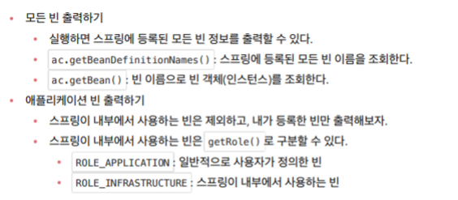
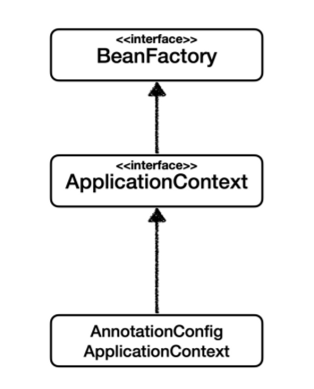

# 스프링 컨테이너 & 스프링 빈

- ## 스프링 컨테이너 생성
    - `ApplicationContext` 는 스프링 컨테이너이고 인터페이스이다.
        - 어노테이션 기반의 자바 설정 클래스로 대부분 만든다.
        - BeanFactory와 구분해서 이야기하지만 거의 쓰이지 않는다.
    - 스프링 컨테이너의 생성과정
    - 스프링 컨테이너 생성 ( 빈 이름 , 빈 객체 ) 테이블 → 스프링 빈 등록 ( 각각 채워진다 ) name을 이용해서 빈 이름을 직접 부여할 수 도 있음 → 스프링 빈 의존관계 설정 - 준비 → 스프링 빈 의존관계 설정 - 완료
- ## 컨테이너에 등록된 모든 빈 조회

  

- ## 스프링 빈 조회 - 기본
    - 구체 타입으로 조회하면 변경 시에 유연하지 못하다.
    - *`assertThrows*(NoSuchBeanDefinitionException.class, () -> ac.getBean("xxxx", MemberService.class));`  `NoSuchBeanDefinitionException`  예외는 조회 대상 스프링 빈이 없으면 발생하는 예외이다.
- ## 스프링 빈 조회 - 동일한 타입이 둘 이상
    - 타입으로 빈을 조회했을 때 동일한 타입이 둘 이상 있다면 중복 오류가 발생한다. `NoUniqueBeanDefinitionException` 예외가 발생한다.
    - 특정 타입의 빈을 모두 조회할 때에는 `Map<String, MemberRepository> beansOfType = ac.getBeansOfType(MemberRepository.class);` 이런식으로 조회한다.
- ## 스프링 빈 조회 - 상속 관계
    - 부모 타입으로 조회하면 자식 타입도 함께 조회된다.
    - 모든 자바 객체의 최고 조상인 Object 타입으로 조회하면 모든 빈을 조회한다.
    - 빈 이름을 지정하여 조회하거나 , 특정 하위타입을 조회한다.
    - 사실상 의존관계를 getBean 할 일은 거의 없다.
- ## BeanFactory 와 ApplicationContext

  

    - BeanFactory 는 스프링 컨테이너의 최상위 인터페이스이다. 스프링 빈을 관리하고 조회하는 역할을 담당한다.
    - ApplicationContext 는 BeanFatory 기능을 모두 상속받아서 제공한다. 그렇다면 둘의 차이는? → 애플리케이션을 개발할 때는 빈을 관리하고 조회하는 기능은 물론이고 부가기능이 필요하다. 이를 ApplicationContext 가 제공한다.
        - 메시지소스를 활용한 국제화 기능
            - 한국에서는 한국어로, 영어권에서는 영어로 출력
        - 환경변수
            - 로컬 개발 운영 등을 구분해서 처리한다.
        - 애플리케이션 이벤트
            - 이벤트를 발행하고 구독하는 모델을 편리하게 지원한다.
        - 편리한 리소스 조회
            - 파일 클래스패스 외부 등에서 리소스를 편리하게 조회할 수 있게 한다.
    - 따라서 BeanFactory 의 기능에 부가기능을 추가한 ApplicationContext 를 대부분 사용한다. 이것들을 스프링 컨테이너 라고 한다.
- ## 다양한 설정 형식 지원 - 자바 코드 , XML 등
    - XML로 과거에는 설정 정보를 작성했으나 최근에는 스프링 부트를 사용하면서 XML을 잘 사용하지 않는다. 레거시 프로젝트들이 XML로 되어있고 컴파일 없이 빈 설정 정보를 변경 가능한 장점이 있기는 하다.
- ## 스프링 빈 설정 메타 정보 - BeanDefinition
    - BeanDefinition 을 빈 설정 메타정보라고 한다. `@Bean` <bean> 각각 하나씩 메타 정보가 생성된다. 스프링 컨테이너는 이 메타정보를 기반으로 스프링 빈을 생성한다. 즉 스프링 컨테이너는 BeanDefinition 만 바라본다. xml 이나 자바 코드로 작성된 여부는 중요하지 않다.
    - BeanDefinition 에는 빈에 관련된 여러 설정과 정보들이 들어 있다.
    - BeanDefinition 을 직접 생성해서 스프링 컨테이너에 등록할 수 있지만 실무에서 그렇게 쓰는 일은 거의 없다.
    - XML 은 빈을 직접 생성해서 등록하는 방법 , 자바코드 AppConfig 는 팩토리 메서드를 이용해서 빈을 등록하는 방법이다.